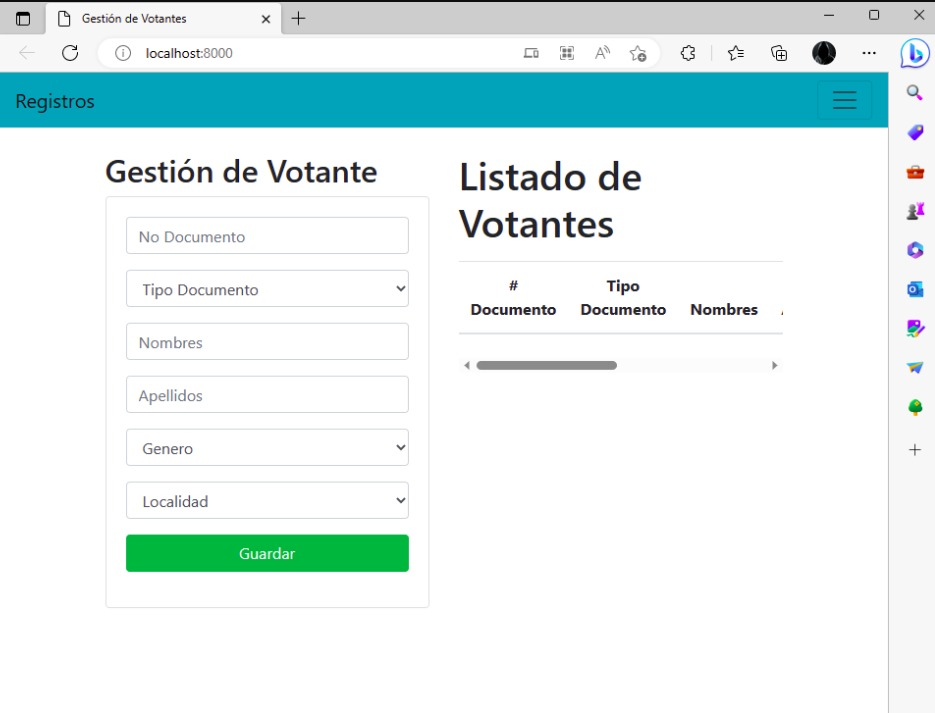
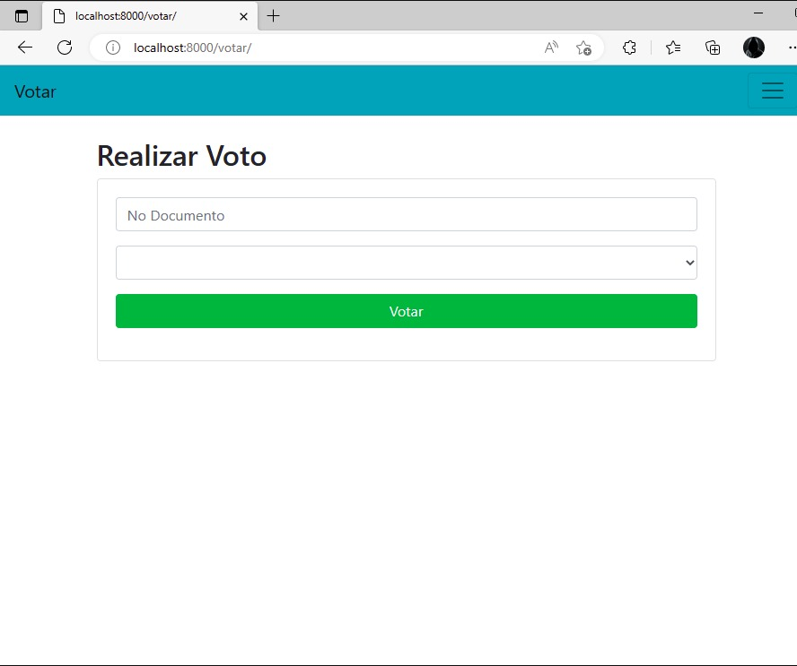

# Prueba técnica — Django developer

## Objetivo

El objetivo de esta prueba técnica es que el candidato muestre sus habilidades con las herramientas que utilizará luego en su trabajo diario en digitalWareAdvisory. Está diseñado para verificar las habilidades de desarrollo back-end utilizando Django y su capacidad para resolver problemas.

Pondremos el foco en obtener un **código simple, bien diseñado y organizado, eficaz, testeado y sobretodo en docker**, así como el cumplimiento de todos los requerimientos solicitados.

## Desarrollo del proyecto

- Se deberá clonar este repositorio para poder modificarlo y completarlo con la resolución del proyecto.
- Una vez que su código esté listo, suba el código a un repositorio público propio y envíenos el enlace a dicho repositorio para que lo revisaremos.

## Prueba técnica

1. Se deberá crear un sistema votaciones donde se deberá registrar la información
de los votantes tales como Nombre, Apellidos, Tipo de documento, No de
documento, Género y Localidad.

2. Se deberá registrar los candidatos en un formulario donde se deberá guardar la
información del candidato, el partido y la localidad

3. Una vez registrado los votantes y los candidatos se deberá registrar en una vista el
voto donde se deberá ingresar el votante y el candidato por el cual votará, para
votar se deben cumplir también las siguientes restricciones:

a) Deben existir tanto el votante como el Candidatos ingresados.

b) El votante no podrá realizar el voto por un candidato de una localidad diferente.

c) Un votante no podrá realizar más de un voto.

## consideraciones obligatorias

Version python: Python 3.8

Nombre de la base de datos "sistemavotaciones".

La base de datos que decida implementar debe ser diferente a sqlite, puede usar alguna variante de mysql, u otra, incluso mongo si lo ve util para el proyecto, y la base de datos debe estar debe estar dentro de un contenedor docker. Cada tabla debe poder ser visible desde el panel de administracion de Django y se debe usar el ORM de Django para los query.

Se deberá crear al menos 3 api usando django-rest-framework usando vistas basadas en clases, es decir clases que hereden de APIView, si desea usar *tambien* FormView es libre de hacerlo.

Se deberá incluir también `README` con instrucciones de configuración/ejecución y cualquier prueba u otra documentación que haya creado como parte de su solución.

Además, agregue la siguiente información a su archivo `README`:

- ¿Cómo decidió las opciones técnicas y arquitectónicas utilizadas como parte de su solución?
- ¿Hay alguna mejora que pueda hacer en su envío?
- ¿Qué haría de manera diferente si se le asignara más tiempo?
- Archivo requirements.txt: Contenido de las librerias utilizadas

## Apoyo visual

Se presenta alguna sugerencia de vistas:

Url vista registro: http://localhost:8000/

Url vista votar:http://localhost:8000/votar/

Recuerde que es una prueba de Backend, por lo que si desea usar boostrap como libreria de estilos u otra que considere oportuna para acelerar su desarrollo, puede hacerlo

## Docker

* Para este proyecto se realiza los campos de Tipo Documento, genero y localidad normalizadas, lo cual se agrega los siguientes datos desde el administrador de Django, por tal motivo se debe crear el superUser y agregar la información para la vista de la siguiente manera

Genero:
* Femenino
* Masculino

TipoDocumento:
* Cedula de ciudadanía
* Cédula de extranjería

Localidad:
A
B
C
D
E

Antes de registrar debemos crear el superusuario
ingresa el siguiente comando 
- docker ps, para saber el nombre del proyecto docker

ejecutamos
- docker exec -it nombre del doker /bin/sh

- python manage.py createsuperuser

Ingresamos los datos de usuario, correo y password

Después de las migraciones

- python manage.py migrate

## Requisitos de Stack

Importante saber:
- No es necesario crear un entorno de desarrollo/producción.
- Se pueden utilizar otras librerías que crea conveniente, aunque se recomienda proporcionar una solución básica ajustada a lo solicitado, ya que nuestro objetivo principal es evaluar sus habilidades con Django y python.
- Como empresa, creemos que la comunicación es la clave del éxito. Entonces, si algo no está claro, o si tiene dudas sobre la tarea, consultanos!

## Opcionales

- incorporar JWT en su backend, para que solo se pueda acceder a las vistar estando autenticado.

- separar el backend del frontend en aplicaciones distintas y que funcionen en puertos distintos

- Realizar test unitarios, ya sea con unitest o pytest.

- Vista formulario para crear el usuario

> Sorprendenos...

> Happy coding!

